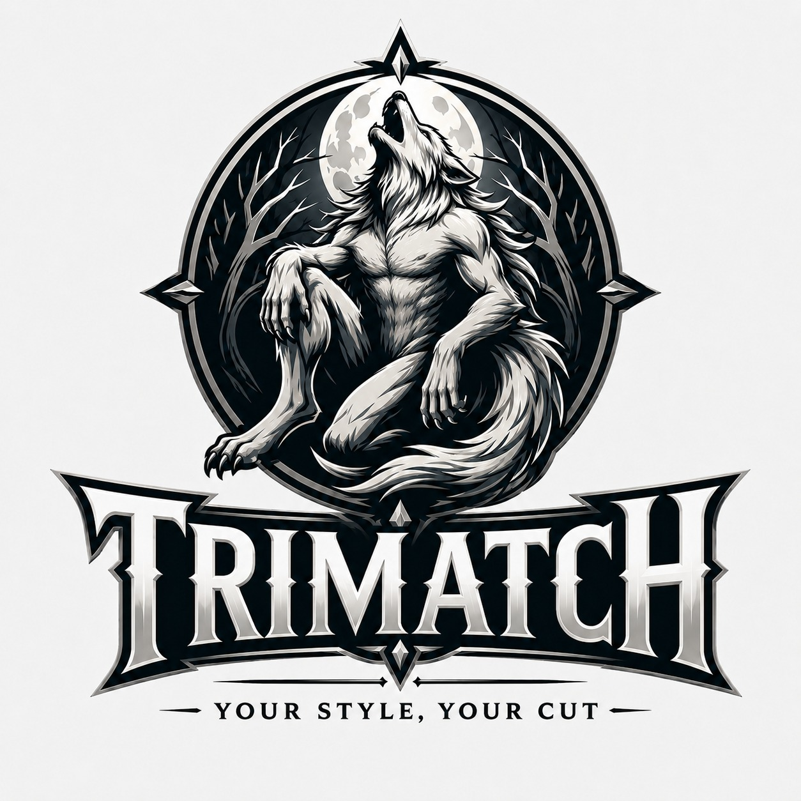

# Trimatch: Your Style, Your Cut
## AI-Based Hairstyle Recommendation for Men Based on Face Shape



# Final Project Student Hacktiv8 Batch HCK-042 FTDS

*Project ini dibuat sebagai bukti penerapan pembelajaran Data Science, Machine Learning, Deep Learning, Computer Vision, serta deployment aplikasi dalam Final Project Hacktiv8.*

---

* Anggota Proyek:

  * Muhammad Cesar Rivaldo
  * Muhammad Rafi Addien
  * Muhammad Zaky Ramadhan
  * Muhammad Zulyandhika

---

## Tentang Proyek Akhir

### **Trimatch: Your Style, Your Cut**

**Trimatch** adalah aplikasi berbasis Computer Vision yang dirancang untuk mengklasifikasikan bentuk wajah pria ke dalam empat kategori, yaitu **ovale**, **rectangular**, **round**, dan **square**.

Hasil klasifikasi kemudian dapat digunakan sebagai dasar untuk memberikan rekomendasi gaya rambut yang sesuai dengan bentuk wajah pengguna.

Model utama yang digunakan adalah **MobileNetV2** dengan pendekatan **transfer learning** dan **fine-tuning**.

---

### Latar Belakang

Pemilihan gaya rambut merupakan salah satu aspek yang dapat memengaruhi penampilan seseorang. Salah satu faktor yang umum digunakan oleh barber atau hairstylist dalam memberikan rekomendasi adalah bentuk wajah.

Namun, tidak semua orang dapat menentukan bentuk wajahnya sendiri secara akurat. Perbedaan antara bentuk wajah seperti `ovale`, `round`, `square`, dan `rectangular` juga sering kali tidak memiliki batas visual yang benar-benar jelas.

Oleh karena itu, proyek ini mencoba mengotomatisasi proses identifikasi bentuk wajah menggunakan metode **Deep Learning berbasis Computer Vision**.

Selain membangun model klasifikasi, proyek ini juga berfokus pada kualitas data dan protokol evaluasi. Eksperimen dilakukan untuk mengetahui pengaruh **face cropping**, **koreksi label**, **deduplikasi gambar**, serta kualitas anotasi dataset terhadap performa model.

---

### Tujuan Pembuatan Aplikasi

Tujuan utama dari proyek ini adalah membangun aplikasi yang dapat:

1. Mengidentifikasi bentuk wajah pria secara otomatis dari sebuah gambar.
2. Mengklasifikasikan wajah ke dalam empat kelas:

   * `ovale`
   * `rectangular`
   * `round`
   * `square`
3. Memberikan dua prediksi bentuk wajah dengan probabilitas tertinggi.
4. Memberikan rekomendasi gaya rambut berdasarkan hasil klasifikasi bentuk wajah.
5. Menyediakan proses klasifikasi melalui upload gambar maupun kamera.
6. Mengetahui pengaruh tahapan preprocessing terhadap performa model.
7. Mengevaluasi pengaruh kualitas anotasi dan duplikasi gambar terhadap hasil klasifikasi.

---

## Dataset

Dataset yang digunakan merupakan dataset publik berisi gambar wajah pria dengan empat kelas bentuk wajah.

Dataset awal memiliki **1.312 gambar** yang kemudian melalui beberapa tahapan pembersihan sebelum digunakan untuk pelatihan model.

| Tahap Dataset                          |    Jumlah |
| -------------------------------------- | --------: |
| Gambar mentah                          |     1.312 |
| Label diperbaiki berdasarkan nama file |        59 |
| Gambar duplikat/nyaris identik dibuang |       173 |
| Dataset final                          | **1.139** |
| Wajah berhasil terdeteksi              | **98,9%** |

Dataset awal memiliki struktur folder `training_set` dan `testing_set`. Namun, pada evaluasi final seluruh data digabungkan terlebih dahulu, dilakukan deduplikasi secara global, kemudian dibagi ulang menggunakan **Stratified 5-Fold Cross Validation**.

---

## Data Preprocessing

Sebelum digunakan untuk pelatihan model, gambar melalui beberapa tahapan preprocessing.

### 1. Perbaikan Format Gambar

Sebagian file memiliki ekstensi `.jpg`, tetapi sebenarnya disimpan menggunakan format WEBP.

File tersebut dikonversi agar dapat dibaca secara konsisten oleh pipeline pelatihan.

### 2. Koreksi Label Berdasarkan Nama File

Ditemukan **59 gambar** yang berada pada folder kelas yang tidak sesuai dengan informasi kelas pada nama filenya.

Contoh:

```text
image square 158.jpg
```

ditemukan berada di folder:

```text
rectangular
```

Label gambar tersebut kemudian diperbaiki sebelum proses pelatihan.

### 3. Face Cropping

Deteksi wajah dilakukan menggunakan **Haar Cascade**.

Setelah wajah ditemukan, area wajah dipotong dengan tambahan margin sebesar **35%** agar bagian kepala dan kontur wajah tetap tersedia untuk model.

Eksperimen ablasi menunjukkan bahwa face cropping merupakan preprocessing dengan kontribusi terbesar terhadap performa model.

**Peningkatan akurasi: +5,14 poin.**

### 4. Deduplikasi

Deteksi gambar duplikat atau hampir identik dilakukan menggunakan **perceptual hashing (dHash)** dengan ambang batas **Hamming Distance ≤ 5**.

Sebanyak **173 gambar** dihapus dari dataset.

Deduplikasi dilakukan sebelum pembagian fold untuk mencegah gambar yang hampir identik muncul pada data training dan testing secara bersamaan.

Tanpa deduplikasi, akurasi model terlihat sekitar **4,67 poin lebih tinggi secara semu**.

---

## Metode Evaluasi

Dalam pengembangan proyek ini digunakan dua protokol evaluasi.

### Protokol A — Original Dataset Split

Model dilatih menggunakan pembagian `training_set` dan `testing_set` bawaan dataset.

Hasil yang diperoleh selama eksperimen:

| Eksperimen            | Akurasi |
| --------------------- | ------: |
| Eksperimen awal       |   39,2% |
| Eksperimen berikutnya |   44,4% |
| Eksperimen berikutnya |   43,5% |

Analisis lebih lanjut menunjukkan bahwa gambar yang berasal dari `testing_set` secara konsisten sekitar **11 poin lebih sulit** dibanding gambar yang berasal dari `training_set`.

---

### Protokol B — Stratified 5-Fold Cross Validation

Pada protokol final:

1. Seluruh gambar digabungkan.
2. Deduplikasi dilakukan secara global.
3. Dataset dibagi menggunakan **Stratified 5-Fold Cross Validation**.
4. Setiap gambar menjadi data testing tepat satu kali.
5. Prediksi seluruh test fold digabungkan menjadi **Out-of-Fold Prediction (OOF)**.

Protokol ini digunakan sebagai hasil utama karena memberikan estimasi performa yang lebih representatif untuk dataset yang relatif kecil.

---

## Model

Model utama yang digunakan adalah **MobileNetV2** yang telah dilatih sebelumnya menggunakan dataset **ImageNet**.

Arsitektur akhir:

```text
Input Image
    ↓
MobileNetV2 (ImageNet)
    ↓
Global Average Pooling
    ↓
Dropout (0.25)
    ↓
Dense (128)
    ↓
Dropout (0.15)
    ↓
Dense (4, Softmax)
```

---

## Training Strategy

Pelatihan dilakukan dalam dua tahap.

### Tahap 1 — Training Classification Head

Backbone MobileNetV2 dibekukan.

```text
Learning Rate = 1e-3
```

Pada tahap ini hanya classification head yang dilatih.

### Tahap 2 — Fine-Tuning

Sebanyak **60 layer teratas MobileNetV2** dibuka untuk fine-tuning.

```text
Learning Rate = 1e-5
```

Layer **Batch Normalization tetap dibekukan** untuk menjaga kestabilan proses fine-tuning.

---

## Data Augmentation

Augmentasi yang digunakan:

```text
Horizontal Flip
Rotation = 0.06
Zoom = 0.06
Label Smoothing = 0.05
```

Augmentasi digunakan untuk meningkatkan variasi data tanpa mengubah karakteristik utama bentuk wajah.

---

## Pencegahan Data Leakage

Dalam protokol final, validation set hanya diambil dari bagian training pada masing-masing fold.

Skema pembagian:

```text
Dataset
   ↓
5-Fold Cross Validation
   ↓
Training Fold ─────── Test Fold
   ↓
85% Training
15% Validation
```

Test fold **tidak digunakan sebagai validation set**.

Langkah ini penting karena eksperimen sebelumnya menunjukkan bahwa penggunaan test fold sebagai validation dapat meningkatkan hasil sekitar **2–4 poin secara semu**.

---

## Hasil Model

Hasil final menggunakan **5-Fold Out-of-Fold Prediction** pada seluruh **1.139 gambar**:

| Metrik               |             Nilai |
| -------------------- | ----------------: |
| OOF Accuracy         | **61,11% ± 1,29** |
| Top-2 Accuracy       |        **82,88%** |
| Random Guess         |            25,00% |
| Majority Class Guess |            27,66% |

Akurasi **61,11%** merupakan angka utama yang digunakan sebagai performa final model.

---

## Performa Per Kelas

| Kelas       | Precision |    Recall | F1-Score |
| ----------- | --------: | --------: | -------: |
| ovale       |     0,629 |     0,511 |    0,564 |
| rectangular |     0,600 |     0,710 |    0,651 |
| round       | **0,822** |     0,503 |    0,624 |
| square      |     0,512 | **0,755** |    0,610 |

Kelas `square` memiliki recall tertinggi sebesar **75,5%**, namun precision terendah sebesar **51,2%**.

Hal ini menunjukkan bahwa model cenderung memilih kelas `square` ketika tidak yakin dengan prediksinya.

Sebaliknya, kelas `round` memiliki precision tertinggi sebesar **82,2%**, tetapi recall hanya **50,3%**. Artinya model relatif jarang memilih kelas `round`, tetapi ketika kelas tersebut dipilih, prediksinya lebih sering benar.

---

## Confusion Matrix Analysis

Kesalahan klasifikasi paling sering terjadi pada pasangan berikut:

| Prediksi Salah      | Jumlah |
| ------------------- | -----: |
| ovale → square      |     85 |
| round → square      |     81 |
| ovale → rectangular |     57 |
| round → ovale       |     42 |

Model memiliki kecenderungan menjadikan `square` sebagai kelas penampung ketika karakteristik gambar tidak dapat dibedakan dengan cukup jelas.

---

## Studi Ablasi

Eksperimen dilakukan untuk mengetahui kontribusi masing-masing tahapan preprocessing.

| Tahapan       |               Efek terhadap evaluasi |
| ------------- | -----------------------------------: |
| Face Cropping |                       **+5,14 poin** |
| Koreksi Label |                           +1,89 poin |
| Deduplikasi   | Mencegah **+4,67 poin akurasi semu** |

Face cropping menjadi tahapan preprocessing yang memberikan peningkatan performa paling besar.

Sementara itu, deduplikasi tidak meningkatkan angka akurasi. Sebaliknya, akurasi menjadi lebih rendah setelah deduplikasi dilakukan.

Hal tersebut merupakan hasil yang diharapkan karena tanpa deduplikasi terdapat gambar yang hampir identik pada training dan testing sehingga performa model terlihat lebih tinggi daripada kemampuan sebenarnya.

---

## Baseline Model

Beberapa metode dibandingkan untuk mengetahui kontribusi transfer learning dan fine-tuning.

| Metode                                 |   Akurasi |
| -------------------------------------- | --------: |
| Random Guess                           |     25,2% |
| Majority Class                         |     27,7% |
| CNN From Scratch                       |    24–44% |
| Logistic Regression + Frozen Embedding |     60,4% |
| **MobileNetV2 Fine-Tuned**             | **61,1%** |

### CNN From Scratch

CNN yang dilatih dari awal menunjukkan performa yang tidak stabil.

Dari lima fold:

* satu fold mencapai **43,67%**
* empat fold lainnya berada di sekitar **25%**

Hal tersebut menunjukkan bahwa dataset sekitar 900 gambar training per fold belum cukup stabil untuk melatih CNN sepenuhnya dari awal.

Jika dibandingkan dengan fold terbaik CNN from scratch sekitar **44%**, transfer learning memberikan peningkatan realistis sekitar **17 poin**.

### Logistic Regression

Regresi logistik menggunakan embedding MobileNetV2 yang dibekukan sudah mencapai akurasi sekitar **60,4%**.

Hasil tersebut sangat dekat dengan MobileNetV2 yang di-fine-tune sebesar **61,1%**.

Hal ini menunjukkan bahwa sebagian besar kemampuan klasifikasi berasal dari representasi fitur hasil pretraining ImageNet.

Walaupun selisihnya kecil, uji **McNemar** menunjukkan bahwa fine-tuning memberikan peningkatan yang signifikan secara statistik:

```text
p-value = 0.046
```

---

## Analisis Kualitas Dataset

Selama eksperimen ditemukan beberapa indikasi masalah kualitas anotasi.

### 1. Salah Folder

Ditemukan **59 gambar** yang kelas pada nama filenya berbeda dengan folder tempat gambar tersebut berada.

### 2. Blok Gambar Mencurigakan

Pada kelas `ovale`, gambar dengan nomor sekitar **500–549** menunjukkan pola yang tidak biasa.

Sebanyak **24 dari 35 gambar** pada bagian tersebut diprediksi sebagai `rectangular` dengan confidence tinggi.

Hal tersebut menunjukkan kemungkinan adanya satu batch data yang ditempatkan pada kelas yang kurang tepat.

### 3. High-Confidence Misclassification

Ditemukan **57 gambar** yang salah diklasifikasikan dengan confidence lebih dari **90%**.

Gambar-gambar tersebut dicatat sebagai kandidat mislabel pada:

```text
artifacts/suspected_mislabels.csv
```

---

## Confident Learning

Untuk menguji apakah label yang salah menjadi penyebab utama rendahnya akurasi, digunakan pendekatan **Confident Learning**.

Pembersihan label hanya dilakukan pada data training di setiap fold. Test fold tetap menggunakan label asli.

| Eksperimen            | Akurasi |
| --------------------- | ------: |
| Tanpa Label Cleaning  |  62,51% |
| Dengan Label Cleaning |  62,16% |

Hasil uji McNemar:

```text
76 prediksi berubah menjadi salah
72 prediksi berubah menjadi benar

p-value = 0.805
```

Tidak ditemukan peningkatan performa yang signifikan dari pembersihan label.

Hal tersebut menunjukkan bahwa sebagian besar kesalahan klasifikasi kemungkinan berasal dari **ambiguitas visual antar-kelas**, bukan hanya akibat kesalahan anotasi.

Temuan tersebut juga didukung oleh **Top-2 Accuracy sebesar 82,88%**, yang menunjukkan bahwa pada sebagian besar kasus kelas yang benar masih berada dalam dua prediksi teratas model.

---

## Analisis Asal Gambar

Salah satu temuan penting selama eksperimen adalah adanya perbedaan tingkat kesulitan antara gambar yang awalnya berasal dari `training_set` dan `testing_set`.

Temuan ini berhasil direplikasi beberapa kali.

| Eksperimen | Selisih Akurasi | z-score |
| ---------- | --------------: | ------: |
| v6         |     +10,68 poin |    3,40 |
| v9         |     +11,75 poin |    3,73 |
| v10        |     +11,53 poin |    3,67 |
| v14        |     +11,59 poin |    3,62 |

Gambar dari `testing_set` secara konsisten sekitar **11 poin lebih sulit**.

Hipotesis awal adalah adanya **domain shift** antara kedua subset.

Untuk mengujinya, dibuat binary classifier untuk memprediksi apakah sebuah gambar berasal dari `training_set` atau `testing_set`.

Hasil:

```text
Binary Classifier Accuracy : 70.18%
Majority Baseline          : 69.10%
```

Karena hasil classifier hanya sedikit lebih baik dibanding majority baseline, tidak ditemukan bukti kuat bahwa kedua subset memiliki perbedaan visual yang jelas.

Dengan demikian, hipotesis bahwa perbedaan performa disebabkan oleh **domain shift dari proses pengumpulan data** tidak didukung oleh eksperimen.

---

## Cara Kerja Aplikasi

Alur utama aplikasi:

```text
Input Gambar / Kamera
        ↓
Deteksi Wajah
        ↓
Face Cropping
        ↓
Resize & Preprocessing
        ↓
MobileNetV2
        ↓
Probabilitas 4 Bentuk Wajah
        ↓
Top-1 & Top-2 Prediction
        ↓
Rekomendasi Gaya Rambut
```

Pengguna dapat memberikan input melalui:

* upload gambar;
* kamera;
* batch image processing;
* aplikasi kamera realtime.

Setelah wajah terdeteksi, gambar diproses oleh model untuk menghasilkan probabilitas dari empat kelas bentuk wajah.

Karena Top-2 Accuracy model jauh lebih tinggi dibanding Top-1 Accuracy, aplikasi menampilkan **dua prediksi tertinggi** kepada pengguna.

---

## Fitur Aplikasi

Aplikasi menyediakan beberapa fitur utama:

### Image Upload

Pengguna dapat mengunggah gambar wajah untuk dianalisis.

### Camera Input

Pengguna dapat mengambil foto langsung menggunakan kamera.

### Batch Processing

Beberapa gambar dapat dianalisis sekaligus.

### Real-Time Camera

Tersedia aplikasi kamera realtime yang dapat melakukan klasifikasi bentuk wajah dan menyimpan screenshot.

### Top-2 Prediction

Aplikasi menampilkan dua bentuk wajah dengan probabilitas tertinggi.

### Confidence Indicator

Tingkat confidence model ditampilkan menggunakan indikator visual.

### Face Detection Warning

Jika wajah tidak berhasil dideteksi, aplikasi memberikan peringatan kepada pengguna.

### Hairstyle Recommendation

Berdasarkan hasil klasifikasi, aplikasi memberikan rekomendasi gaya rambut yang sesuai dengan kelas bentuk wajah pengguna.

---

## Project Output

Aplikasi dikembangkan menggunakan **Streamlit** sebagai antarmuka utama berbasis web.

Output proyek meliputi:

```text
Model Klasifikasi Bentuk Wajah
        +
Streamlit Web Application
        +
Real-Time Camera Application
        +
Hairstyle Recommendation System
```

File utama aplikasi meliputi:

```text
app.py
live_camera.py
faceshape.py
```

---

## Kesimpulan

Berdasarkan hasil eksperimen, diperoleh beberapa kesimpulan utama:

1. **MobileNetV2 dengan transfer learning dan fine-tuning mencapai akurasi OOF sebesar 61,11% ± 1,29** pada klasifikasi empat bentuk wajah pria.

2. Model mencapai **Top-2 Accuracy sebesar 82,88%**, menunjukkan bahwa kelas yang benar sering kali masih berada di antara dua prediksi dengan probabilitas tertinggi.

3. **Face cropping** merupakan preprocessing yang memberikan kontribusi paling besar terhadap performa dengan peningkatan sekitar **5,14 poin**.

4. **Deduplikasi merupakan tahap penting dalam evaluasi model.** Tanpa deduplikasi, akurasi terlihat sekitar **4,67 poin lebih tinggi secara semu** akibat kemungkinan gambar yang hampir identik berada pada data training dan testing.

5. **Pembersihan label menggunakan Confident Learning tidak meningkatkan performa secara signifikan** dengan hasil McNemar `p = 0.805`.

6. Logistic Regression menggunakan fitur MobileNetV2 yang dibekukan sudah mencapai **60,4%**, sangat dekat dengan model fine-tuned sebesar **61,1%**. Hal tersebut menunjukkan bahwa fitur hasil pretraining ImageNet memberikan kontribusi besar terhadap kemampuan klasifikasi.

7. Keterbatasan utama sistem kemungkinan tidak hanya berasal dari kapasitas model, tetapi juga dari **ukuran dataset, kualitas anotasi, dan ambiguitas visual antar-kelas bentuk wajah**.

---

## Pengembangan Selanjutnya

Beberapa pengembangan yang dapat dilakukan pada penelitian selanjutnya:

1. Menggunakan dataset yang lebih besar dengan prosedur anotasi yang lebih terdokumentasi.
2. Melakukan anotasi menggunakan beberapa manusia untuk menghitung **inter-annotator agreement**.
3. Menggunakan **MediaPipe FaceMesh** untuk melakukan face alignment.
4. Mengekstraksi fitur geometris wajah secara eksplisit, seperti:

   * rasio lebar rahang terhadap tinggi wajah;
   * rasio lebar dahi;
   * panjang wajah;
   * lebar cheekbone;
   * sudut rahang.
5. Menggabungkan fitur geometris dengan deep learning.
6. Mengembangkan sistem rekomendasi hairstyle yang lebih personal dengan mempertimbangkan karakteristik tambahan selain bentuk wajah.

---

## Catatan Integritas Eksperimen

Eksperimen v11 dan v12 menggunakan test fold sebagai validation set sehingga nilai absolut dari eksperimen tersebut dapat mengalami peningkatan sekitar **2–4 poin** akibat data leakage.

Oleh karena itu:

```text
v11 → hanya perbandingan relatif studi ablasi yang digunakan
v12 → hanya perbandingan relatif head vs fine-tuning dan McNemar yang digunakan
v14 → digunakan sebagai hasil final
```

Akurasi final yang dilaporkan adalah:

```text
61.11% ± 1.29
```

yang berasal dari protokol tanpa penggunaan test fold sebagai validation set.

---

## Struktur File

```text
project/
│
├── notebooks/
│   ├── 14_train_final.ipynb
│   └── 15_inference_final.ipynb
│
├── artifacts/
│   └── suspected_mislabels.csv
│
├── app.py
├── live_camera.py
├── faceshape.py
│
└── README.md
```

---

## Notebook

| Notebook | Penggunaan                                  |
| -------- | ------------------------------------------- |
| 1–3      | Eksperimen original split dan koreksi label |
| 4        | Pengujian hipotesis domain shift            |
| 5–8      | Pengembangan 5-Fold OOF                     |
| 9–10     | Confident Learning                          |
| 11       | Ablation Study                              |
| 12       | Baseline dan Fine-Tuning Comparison         |
| 14       | **Final Training & Evaluation**             |
| 15       | **Inference & Application**                 |

---

## Final Performance

```text
Dataset Final       : 1,139 images
Number of Classes   : 4
Model               : MobileNetV2
Evaluation          : Stratified 5-Fold OOF

Accuracy            : 61.11% ± 1.29
Top-2 Accuracy      : 82.88%

Random Baseline     : 25.00%
Majority Baseline   : 27.66%
```

### **Trimatch: Your Style, Your Cut**

*Matching your face shape with a hairstyle that fits you.*
